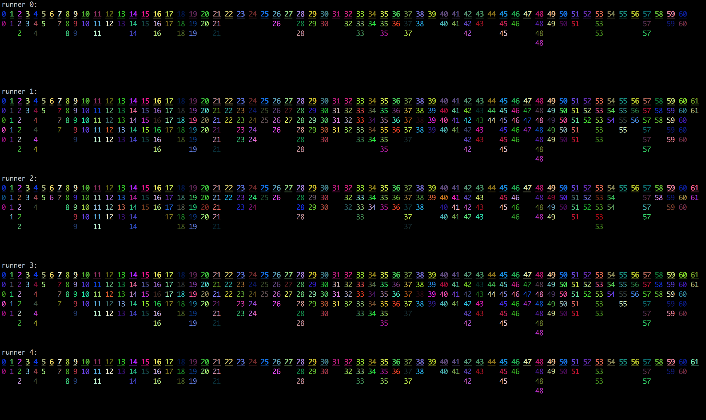

# Lapidar

Carve it in stone. Only that these stones are easy to move across the internet.
This is a multi purpose blockchain on which you can build some custom business logic.

## Installation

Add this line to your application's Gemfile:

```ruby
gem 'lapidar'
```

And then execute:

    $ bundle

Or install it yourself as:

    $ gem install lapidar

## Usage

Have a look at `bin/run`. You'll see that 5 nodes spin up and connect to each other
via [buschtelefon](https://github.com/renuo/lapidar) and contest each other
in race which looks like this:



To get a colorful output like this you need to install the gem [*paint*](https://github.com/janlelis/paint).

## Development

After checking out the repo, run `bin/setup` to install dependencies.
Then, run `rake spec` to run the tests. You can also run `bin/console`
for an interactive prompt that will allow you to experiment.

To install this gem onto your local machine, run `bundle exec rake install`.
To release a new version, update the version number in `version.rb`, and then
run `bundle exec rake release`, which will create a git tag for the version,
push git commits and tags, and push the `.gem` file
to [rubygems.org](https://rubygems.org).

## Contributing

Bug reports and pull requests are welcome on GitHub at <https://github.com/renuo/lapidar>.

## License

The gem is available as open source under the terms of the [MIT License](https://opensource.org/licenses/MIT).
